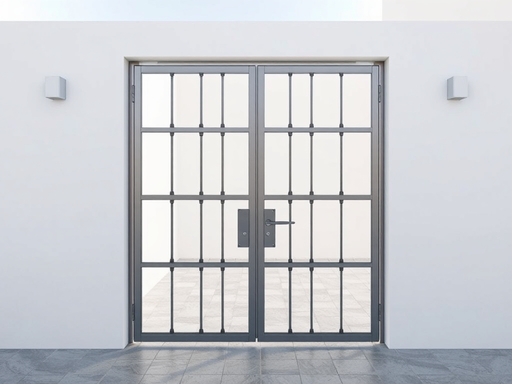

# P-2026-0014 Presupuesto Puerta Peatonal de Tubo y Malla Hércules - Menorca

Fecha: 2026-07-21
Origen: presupuestador-app

## Cliente

- Nombre: giovanna
- Email:
- Telefono:
- Direccion/obra:
- NIF/CIF:
- Referencia interna:

## Resumen

Fabricación y montaje de puerta peatonal a medida de 1.00 x 2.00 m con bastidor de tubo de acero 40x40x2 mm, relleno de malla Hércules, equipada con cerradura de seguridad, 3 bisagras reforzadas y acabado con tratamiento anticorrosivo Oxirón verde carruaje apto para el ambiente salino de Menorca.

_Imagen orientativa generada por IA. El diseno final dependera de medidas, materiales, acabados y validacion tecnica._

## Lineas del compuesto

| ID | Capitulo | Concepto | Cantidad | Unidad | Precio unitario | Importe | Confianza |
|---|---|---|---:|---|---:|---:|---|
| L1 | Diseno | Diseño y despiece técnico | 1 | h | 30.00 | 30.00 | alta |
| L2 | Materiales | Tubo de acero al carbono 40x40x2 mm | 15 | kg | 1.80 | 27.00 | alta |
| L3 | Materiales | Malla Hércules verde carruaje | 2 | m2 | 25.00 | 50.00 | media |
| L4 | Materiales | Cerradura de seguridad para exterior | 1 | ud | 45.00 | 45.00 | alta |
| L5 | Materiales | Bisagras de seguridad reforzadas | 3 | ud | 12.00 | 36.00 | alta |
| L6 | Fabricacion | Mano de obra de taller | 4 | h | 30.00 | 120.00 | alta |
| L7 | Tratamiento | Tratamiento anticorrosivo Oxirón Verde Carruaje | 1 | lote | 85.00 | 85.00 | media |
| L8 | Transporte | Transporte local en Menorca | 1 | lote | 45.00 | 45.00 | alta |
| L9 | Montaje | Instalación en obra | 3 | h | 30.00 | 90.00 | alta |
| L10 | Margen | Margen de gestión y mermas | 1 | lote | 50.00 | 50.00 | alta |

**Total estimado:** 578.00 EUR + IVA

## Supuestos

- Se asume una dimensión estándar de puerta peatonal de 1.00 m de ancho por 2.00 m de alto para la estimación de materiales y horas.
- Se asume que existen pilares o soportes firmes y aplomados donde fijar las bisagras y el recibidor de la cerradura.
- Se incluye tratamiento anticorrosivo de alta resistencia (C4) con imprimación epoxi y acabado Oxirón verde carruaje, adecuado para el clima de Menorca.

## Riesgos

- Corrosión prematura si la puerta se instala en primera línea de mar sin herrajes ni bisagras de acero inoxidable AISI 316.
- Desajustes en la apertura si los pilares existentes no están perfectamente aplomados o sufren movimientos estructurales.
- Variación de costes si las medidas reales en obra difieren significativamente de las asumidas (1.00 x 2.00 m).

## Preguntas pendientes

- ¿Cuáles son las dimensiones exactas del hueco de la puerta (ancho x alto)?
- ¿La puerta se anclará a pilares metálicos existentes, pilares de obra o requiere que fabriquemos postes de soporte adicionales?
- ¿El sentido de apertura de la puerta es hacia el interior o exterior, y hacia la derecha o izquierda?
- ¿La ubicación de la instalación está en primera línea de mar o zona de alta exposición salina para valorar bisagras y tornillería en acero inoxidable AISI 316?

## Sugerencias generadas

- **Uso de bisagras de acero inoxidable AISI 316:** Para evitar la oxidación prematura en el ambiente salino de Menorca, se recomienda sustituir las bisagras de acero al carbono por bisagras de acero inoxidable AISI 316.
- **Galvanizado en caliente previo al pintado:** Si la puerta va a estar muy expuesta a la intemperie, se sugiere realizar un proceso de galvanizado en caliente antes de aplicar el acabado Oxirón para garantizar una durabilidad superior a 10 años sin mantenimiento.
