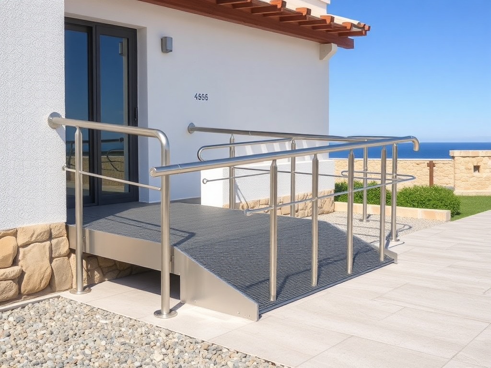

# P-2026-0015 Presupuesto Técnico-Comercial: Rampa de Accesibilidad a Medida con Barandilla

Fecha: 2026-07-22
Origen: presupuestador-app

## Cliente

- Nombre: Antonio y diego
- Email:
- Telefono:
- Direccion/obra:
- NIF/CIF:
- Referencia interna:

## Resumen

Fabricación e instalación de rampa para personas con movilidad reducida (PMR) realizada en chapa lágrima de acero al carbono de 5/3 mm, reforzada inferiormente con costillas estructurales, incluyendo barandilla de 12 metros lineales en tubo de 40x40x2 mm. Tratamiento superficial mediante imprimación rica en zinc y acabado sintético, adaptado al ambiente salino de Menorca.

_Imagen orientativa generada por IA. El diseno final dependera de medidas, materiales, acabados y validacion tecnica._

## Lineas del compuesto

| ID | Capitulo | Concepto | Cantidad | Unidad | Precio unitario | Importe | Confianza |
|---|---|---|---:|---|---:|---:|---|
| L1 | Diseno | Toma de medidas, diseño, despiece y cálculo de pendiente | 4 | h | 35.00 | 140.00 | alta |
| L2 | Materiales | Chapa de acero lágrima 5/3 mm | 130 | kg | 2.40 | 312.00 | alta |
| L3 | Materiales | Perfiles de acero para costillas de refuerzo | 50 | kg | 2.40 | 120.00 | alta |
| L4 | Materiales | Tubo de acero 40x40x2 mm para barandilla | 12 | ml | 8.00 | 96.00 | alta |
| L5 | Materiales | Material auxiliar de fijación y anclaje | 1 | lote | 45.00 | 45.00 | media |
| L6 | Fabricacion | Mano de obra de taller (Herrería) | 12 | h | 30.00 | 360.00 | alta |
| L7 | Tratamiento | Tratamiento anticorrosivo C4 (Imprimación Zinc + Sintético) | 7 | m2 | 25.00 | 175.00 | media |
| L8 | Transporte | Transporte local en Menorca | 1 | lote | 80.00 | 80.00 | alta |
| L9 | Montaje | Mano de obra de montaje en obra | 4 | h | 30.00 | 120.00 | alta |
| L10 | Margen | Margen de riesgo y contingencias de integración | 1 | lote | 177.84 | 177.84 | alta |

**Total estimado:** 1625.84 EUR + IVA

## Supuestos

- Se asume una dimensión estimada de rampa de 3.00 metros de longitud por 1.00 metro de ancho útil (3 m² de superficie).
- Se asume que existe una solera de hormigón firme y nivelada para realizar el anclaje químico de la rampa.
- No se incluye obra civil, demoliciones ni preparación previa del terreno.
- El presupuesto se calcula bajo las condiciones ambientales por defecto de Menorca (ambiente salino C4).

## Riesgos

- Riesgo de oxidación prematura: El uso de acero al carbono con pintura sintética simple en exteriores de Menorca tiene una durabilidad limitada frente al galvanizado en caliente.
- Riesgo de deslizamiento: Si la pendiente final supera el 12% debido a limitaciones de espacio, la chapa lágrima podría resultar resbaladiza en días lluviosos.
- Corrosión galvánica: Riesgo de degradación rápida en los puntos de unión si se utiliza tornillería de acero al carbono sin protección en contacto con el anclaje.

## Preguntas pendientes

- ¿Cuáles son las dimensiones exactas requeridas para la rampa (longitud, ancho y altura total a salvar)?
- ¿La rampa se instalará en un espacio público (sujeto a normativa estricta de accesibilidad del 8-10% de pendiente máxima) o privado?
- ¿El pavimento o base donde se va a anclar la rampa es de hormigón sólido o requiere alguna solera previa?
- ¿Se requiere que la barandilla incorpore un doble pasamanos a diferentes alturas según normativa PMR?

## Sugerencias generadas

- **Mejora de tratamiento: Galvanizado en Caliente:** Sustituir la imprimación de zinc por un proceso de galvanizado en caliente por inmersión antes del lacado (sistema dúplex). Esto garantiza una protección C5 marina de más de 20 años sin mantenimiento.
- **Barandilla en Acero Inoxidable AISI 316:** Fabricar el metro lineal de barandilla en acero inoxidable AISI 316 pulido o satinado en lugar de acero pintado, evitando el desgaste por rozamiento continuo en el pasamanos.
- **Memorizar tarifa de hora técnica de diseño a 35 €/h:** Actualizar el repositorio local para consolidar que la tarifa de diseño, toma de medidas y oficina técnica se fije en 35 €/h por defecto.
- **Memorizar tarifa de tubo de acero para barandilla a 8 €/ML:** Actualizar el repositorio local para consolidar que el tubo de acero de 40x40x2 mm para barandilla se presupueste por defecto a 8 €/ML.
