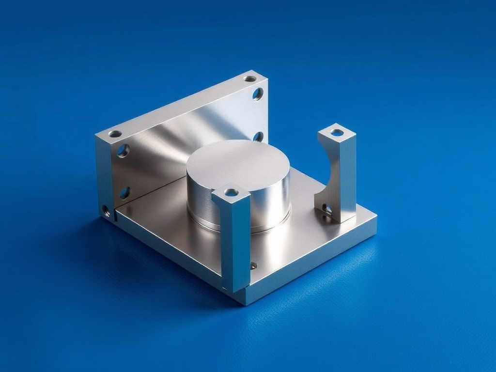

# P-2026-0016 Presupuesto Técnico-Comercial: Soporte Náutico a Medida en Acero Inoxidable AISI 316 para Mástil

Fecha: 2026-07-23
Origen: presupuestador-app

## Cliente

- Nombre: Xavi Marti
- Email:
- Telefono:
- Direccion/obra:
- NIF/CIF:
- Referencia interna:

## Resumen

Fabricación y suministro de soporte de alta resistencia para mástil de barco velero, compuesto por 4 placas de acero inoxidable AISI 316 (calidad marina A4) de 10 mm de espesor, perforadas, soldadas mediante proceso TIG o laser  y pasivadas para ambiente salino severo en Menorca. Incluye únicamente fabricación en taller y entrega.

_Imagen orientativa generada por IA. El diseno final dependera de medidas, materiales, acabados y validacion tecnica._

## Lineas del compuesto

| ID | Capitulo | Concepto | Cantidad | Unidad | Precio unitario | Importe | Confianza |
|---|---|---|---:|---|---:|---:|---|
| L1 | Diseno | Diseño técnico, toma de plantilla y plantilla de perforación | 2 | h | 35.00 | 70.00 | alta |
| L2 | Materiales | Chapa de acero inoxidable AISI 316 (A4) e=10 mm | 15 | kg | 9.00 | 135.00 | alta |
| L3 | Materiales | Consumibles específicos para mecanizado y soldadura Inox 316 | 1 | lote | 35.00 | 35.00 | alta |
| L4 | Fabricacion | Corte manual con amoladora/radial, taladrado y biselado de chapa 10mm | 3.5 | h | 30.00 | 105.00 | media |
| L5 | Fabricacion | Armado y soldadura TIG en acero inoxidable 316 | 2.5 | h | 30.00 | 75.00 | alta |
| L6 | Tratamiento | Decapado, pasivado químico y acabado satinado náutico | 2 | h | 30.00 | 60.00 | alta |
| L7 | Transporte | Embalaje y entrega local en Menorca | 1 | lote | 25.00 | 25.00 | alta |
| L8 | Margen | Margen industrial y gestión de proyecto náutico a medida | 1 | lote | 101.00 | 101.00 | alta |

**Total estimado:** 606.00 EUR + IVA

## Supuestos

- Por defecto en Menorca para entorno náutico/salino C5-M, se presupuesta exclusivamente Acero Inoxidable AISI 316 (A4).
- El alcance contempla únicamente la fabricación y entrega del soporte; no incluye trabajos de montaje a bordo ni tornillería de fijación al mástil.
- El corte de las placas se cotiza mediante amoladora/radial manual según la instrucción del pedido.

## Riesgos

- El corte manual con radial en chapa de 10 mm de acero inoxidable genera un calor elevado que puede destemplar la zona y dejar acabados menos precisos que el corte por agua o láser.
- Riesgo de contaminación férrica durante el corte manual si no se utilizan herramientas estrictamente dedicadas al acero inoxidable.
- Si el mástil tiene una sección ovalada o cónica y no se aporta plantilla física, el asentamiento de las placas planas puede requerir ajustes posteriores.

## Preguntas pendientes

- ¿Dispone de un plano, boceto o plantilla con el diámetro exacto del mástil y la posición de las perforaciones?
- ¿Las placas requieren alguna curvatura o cajeado especial para asentarse sobre el mástil o son completamente planas?
- ¿Requiere un acabado pulido espejo en lugar del acabado satinado/pasivado náutico estándar?

## Sugerencias generadas

- **Sustituir el corte manual por corte por agua o láser CNC:** Para chapas de inox de 10 mm en piezas con alto requerimiento estético y estructural como las de un barco, se aconseja encarecidamente utilizar corte por chorro de agua o láser. Evita el sobrecalentamiento del material, reduce las horas de taller y garantiza taladros y bordes limpios e impecables.
