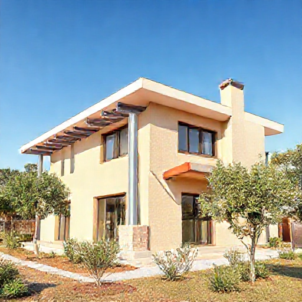

# P-2026-0020 Presupuesto Corregido: Subestructura Galvanizada, Cerramiento Thermoclick y Mantenimiento de Postes

Fecha: 2026-08-04
Origen: presupuestador-app

## Cliente

- Nombre: Club Villa Carlos
- Email:
- Telefono:
- Direccion/obra:
- NIF/CIF:
- Referencia interna:

## Resumen

Presupuesto actualizado según indicación del cliente para la fabricación e instalación de subestructura de tubo galvanizado, cerramiento con sistema Thermoclick de policarbonato en fachadas oeste y sur, pilar intermedio de refuerzo y tratamiento de conservación anticorrosiva C4/C5 en postes existentes.

_Imagen orientativa generada por IA. El diseno final dependera de medidas, materiales, acabados y validacion tecnica._

## Lineas del compuesto

| ID | Capitulo | Concepto | Cantidad | Unidad | Precio unitario | Importe | Confianza |
|---|---|---|---:|---|---:|---:|---|
| L1 | Fabricacion | Subestructura tubo galvanizado 100x50x3 mm - Fachada Oeste | 168 | ml | 35.00 | 5880.00 | alta |
| L2 | Materiales | Sistema Thermoclick Policarbonato - Fachada Oeste | 205 | m2 | 165.00 | 33825.00 | alta |
| L3 | Fabricacion | Subestructura tubo galvanizado 100x50x3 mm - Fachada Sur | 48 | ml | 35.00 | 1680.00 | alta |
| L4 | Fabricacion | Pilar intermedio tubo 100x100x4 mm - Fachada Sur | 1 | ud | 1400.00 | 1400.00 | alta |
| L5 | Materiales | Sistema Thermoclick Policarbonato - Fachada Sur | 60 | m2 | 165.00 | 9900.00 | alta |
| L6 | Tratamiento | Mantenimiento anticorrosivo C4/C5 de postes existentes | 64.8 | m2 | 68.00 | 4406.40 | alta |

**Total estimado:** 57091.40 EUR + IVA

## Supuestos

- Los precios indicados son netos (Base Imponible) y no incluyen el IVA.
- La estructura existente se encuentra en condiciones aceptables de resistencia mecánica para soportar las cargas de viento transmitidas por el cerramiento Thermoclick.
- El tratamiento anticorrosivo de los postes incluye los medios de elevación necesarios según se especifica en la partida de mantenimiento.

## Riesgos

- Riesgo de desviaciones o variaciones en los puntos de anclaje si la estructura existente presenta desniveles o plomos irregulares.
- Limitaciones de montaje por viento elevado en altura durante la colocación de las placas de policarbonato Thermoclick.

## Preguntas pendientes

- ¿El color y la transmisión de luz del policarbonato Thermoclick están ya especificados (p. ej. hielo/opal, transparente, bronce)?
- ¿Se requiere proyecto técnico o certificado estructural firmado para la fijación de la subestructura sobre la estructura existente?

## Sugerencias generadas

- **Memorizar tarifas de sistema Thermoclick y tratamiento C4/C5:** Guardar en el aprendizaje los precios unitarios validados por el cliente: 165 €/m2 para suministro y montaje de Thermoclick, 35 €/ml para subestructura tubo 100x50x3 galvanizado y 68 €/m2 para restauración de postes con rica en zinc y poliuretano.
