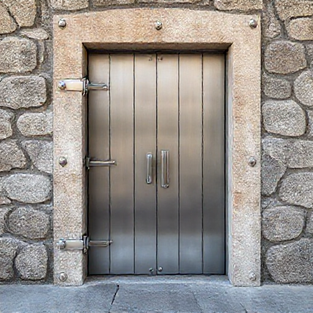

# P-2026-0021 Presupuesto Técnico: Fabricación de Puerta de Arqueta en Acero Inoxidable con Resortes de Gas

Fecha: 2026-08-06
Origen: presupuestador-app

## Cliente

- Nombre:
- Email:
- Telefono:
- Direccion/obra:
- NIF/CIF:
- Referencia interna:

## Resumen

Fabricación a medida de tapa/puerta de arqueta de 1400x1140 mm en acero inoxidable AISI 316 para ambiente marino (Menorca). Incluye marco en ángulo L40x4, bastidor de hoja en L30x3 con 2 costillas de refuerzo en T30, chapa de cubierta, 2 bisagras reforzadas e integración del kit de resortes de gas (14-28 carrera 350) según especificación adjunta.

_Imagen orientativa generada por IA. El diseno final dependera de medidas, materiales, acabados y validacion tecnica._

## Lineas del compuesto

| ID | Capitulo | Concepto | Cantidad | Unidad | Precio unitario | Importe | Confianza |
|---|---|---|---:|---|---:|---:|---|
| L1 | Diseno | Diseño técnico, despiece y simulaciónCinemática de apertura | 4 | h | 35.00 | 140.00 | alta |
| L2 | Materiales | Perfilería en Ángulo L40x4, L30x3 y Té T30 en Acero Inoxidable AISI 316 | 28 | kg | 8.50 | 238.00 | alta |
| L3 | Materiales | Chapa de cubierta en Acero Inoxidable AISI 316 (3 mm) | 38 | kg | 8.50 | 323.00 | alta |
| L4 | Materiales | Bisagras reforzadas de pala en Acero Inoxidable AISI 316 | 2 | ud | 24.00 | 48.00 | alta |
| L5 | Materiales | Kit de resortes de gas 14-28 C350 con anclajes M10 (según adjunto) | 1 | lote | 500.00 | 500.00 | alta |
| L6 | Fabricacion | Mano de obra de taller: corte, armado y soldadura TIG Inox | 8 | h | 30.00 | 240.00 | alta |
| L7 | Tratamiento | Decapado, pasivado y satinado de cordones de soldadura | 1 | lote | 80.00 | 80.00 | alta |
| L8 | Montaje | Transporte e instalación en obra con regulación de muelles | 4 | h | 30.00 | 120.00 | media |

**Total estimado:** 1689.00 EUR + IVA

## Supuestos

- Ubicación en Menorca: se cotiza todo el conjunto metálico en Inox AISI 316 (A4) para prevenir la oxidación acelerada por brisa salina.
- Los datos de fuerza y carrera de los muelles de gas (1200N / C350) se toman directamente de la simulación del cliente adjunta en las imágenes.
- Acceso libre a la arqueta en planta baja sin necesidad de medios auxiliares de elevación especiales.

## Riesgos

- Desalineación o desfasaje en los puntos de reacción de los muelles de gas si la pared de la arqueta de obra no está perfectamente a plomo.
- Acumulación de agua estancada dentro del perfil del marco si no se contemplan taladros de drenaje en las esquinas inferiores del ángulo L40x4.

## Preguntas pendientes

- ¿La chapa superior debe ser antideslizante (lágrima) o lisa?
- ¿La arqueta requiere junta de estanqueidad de EPDM en el perímetro del marco L40x4 para evitar filtración de agua de lluvia?
- ¿Se requiere cerradura, pasador de seguridad o asa escamoteable para la apertura manual desde el exterior?
- ¿El anclaje de la pared de la arqueta es sobre hormigón, obra vista o require pletinas de garra para embutir?

## Sugerencias generadas

- **Uso de Acero Inoxidable AISI 316 obligatorio en arquetas en Menorca:** Memorizar que para registros y arquetas de suelo exteriores en Menorca debe usarse únicamente inoxidable AISI 316 / A4, descartando AISI 304 debido al contacto con humedad de suelo y salinidad.
- **Adición de drenajes y junta EPDM en marcos de arqueta:** Añadir por defecto 2 taladros de drenaje Ø8 mm en las esquinas inferiores del cerco L40x4 y un canal para goma EPDM selladora en las arquetas de intemperie.
