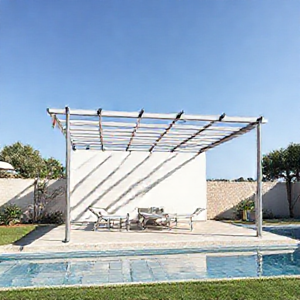

# P-2026-0022 Presupuesto Técnico: Pérgola de Tubo Galvanizado con Cubierta de Cañizo

Fecha: 2026-08-10
Origen: presupuestador-app

## Cliente

- Nombre: Fontenille Torre Vela SL
- Email: g.tulic@fontenillecollection.com
- Telefono:
- Direccion/obra:
- NIF/CIF: B57991135
- Referencia interna:

## Resumen

Fabricación e instalación de pérgola metálica a medida de 7,00 x 4,00 m con estructura en tubo galvanizado de 40x40x2 mm, cubierta ligera de cañizo, acabado imprimado y pintado en negro con protección para ambiente marino en Menorca, y cimentación mediante 8 zapatas de hormigón de 50x50x50 cm.

_Imagen orientativa generada por IA. El diseno final dependera de medidas, materiales, acabados y validacion tecnica._

## Lineas del compuesto

| ID | Capitulo | Concepto | Cantidad | Unidad | Precio unitario | Importe | Confianza |
|---|---|---|---:|---|---:|---:|---|
| L1 | Diseno | Toma de medidas, diseño técnico y cálculo de replanteo | 3 | h | 35.00 | 105.00 | alta |
| L2 | Materiales | Tubo de acero galvanizado 40x40x2 mm | 105 | ml | 8.50 | 892.50 | alta |
| L3 | Materiales | Cubierta de cañizo natural reforzado | 32 | m2 | 12.00 | 384.00 | alta |
| L4 | Materiales | Placas base y anclajes químicos en Acero Inox A4 (AISI 316) | 8 | ud | 28.00 | 224.00 | alta |
| L5 | Fabricacion | Mano de obra de taller para corte, ensamblaje y soldadura | 18 | h | 30.00 | 540.00 | alta |
| L6 | Tratamiento | Sistema de pintura especial C4/C5 Negro Satinado | 1 | lote | 380.00 | 380.00 | media |
| L7 | Montaje | Excavación y vertido de 8 zapatas de hormigón (50x50x50 cm) | 8 | ud | 120.00 | 960.00 | alta |
| L8 | Montaje | Mano de obra de montaje en obra, nivelado y fijación de cañizo | 16 | h | 30.00 | 480.00 | alta |
| L9 | Transporte | Transporte y medios auxiliares a obra en Menorca | 1 | lote | 140.00 | 140.00 | alta |

**Total estimado:** 4105.50 EUR + IVA

## Supuestos

- Se asume terreno excavable sin presencia de roca dura para la ejecución de las 8 zapatas de 50x50x50 cm.
- Por defecto Menorca, se aplica sistema anticorrosivo C4/C5 con imprimación rica en zinc en soldaduras e Inox A4 en anclajes expuestos.
- La sección de tubo de 40x40x2 mm para vigas de 7 metros requiere correas y jácena adecuadamente arriostradas para evitar flexión.

## Riesgos

- Riesgo de flexión o pandeo excesivo en vanos de 7 metros si se usa únicamente tubo de 40x40x2 mm sin viga de mayor canto o jácenas de refuerzo.
- Elevada carga de viento en Menorca que puede rasgar o levantar el cañizo si no se fija con suficiente densidad de bridas/alambre Inox.

## Preguntas pendientes

- ¿La superficie del terreno para las zapatas es de tierra, pavimento o losa existente?
- ¿Hay disponibilidad de toma de agua y electricidad en el lugar de montaje?
- ¿La luz libre de 7 metros requiere algún pilar intermedio adicional o prefiere mantener luz diáfana con cercha/viga reforzada?
- ¿El cañizo requiere ser de bambú pelado, tejido sintético o cañizo nacional estándar?

## Sugerencias generadas

- **Refuerzo estructural de vigas principales:** Para luces de 7 metros, el tubo de 40x40x2 mm resulta demasiado flector. Se sugiere utilizar tubo rectangular de 80x40x2 mm o 100x50x3 mm para las vigas maestras y mantener 40x40x2 mm para correas intermedias.
- **Fijación anticorrosiva para cubierta vegetal:** Utilizar grapas o alambre de acero inoxidable AISI 316 para la fijación del cañizo, evitando alambre galvanizado común que se oxida rápidamente con la brisa salina de Menorca.
