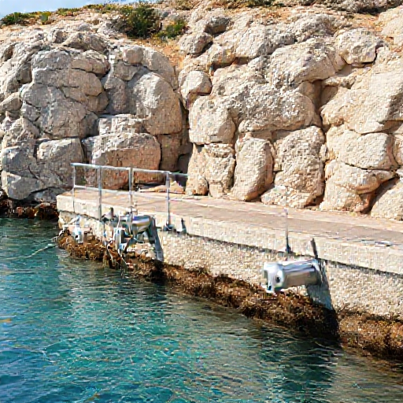

# P-2026-0023 Presupuesto Técnico: Fabricación e Instalación de Barandillas de Acero Inoxidable Lacadas y Pasarela de Tramex PRFV

Fecha: 2026-08-11
Origen: presupuestador-app

## Cliente

- Nombre: Acciona Aguas
- Email:
- Telefono:
- Direccion/obra:
- NIF/CIF:
- Referencia interna:

## Resumen

Presupuesto para la fabricación a medida de 14 ML de barandilla de acero inoxidable AISI 316 (pletina 50x10, pasamanos Ø43 mm y 3 líneas de Ø20 mm) con imprimación y acabado lacado blanco marino, más el suministro e instalación de suelo de tramex de PRFV sobre soporte amurado de tubo inox 80x40 mm en ambiente costero de Menorca.

_Imagen orientativa generada por IA. El diseno final dependera de medidas, materiales, acabados y validacion tecnica._

## Lineas del compuesto

| ID | Capitulo | Concepto | Cantidad | Unidad | Precio unitario | Importe | Confianza |
|---|---|---|---:|---|---:|---:|---|
| L1 | Diseno | Toma de medidas, diseño técnico y planos de despiece | 4 | h | 42.00 | 168.00 | alta |
| L2 | Materiales | Perfilería de acero inoxidable AISI 316 para barandillas (14 ML) | 14 | ml | 62.40 | 873.60 | alta |
| L3 | Materiales | Placas de rejilla Tramex PRFV (Poliéster Reforzado con Fibra de Vidrio) | 2 | ud | 480.00 | 960.00 | alta |
| L4 | Materiales | Tubo estructural de acero inoxidable AISI 316 80x40 mm | 2 | ml | 42.00 | 84.00 | alta |
| L5 | Materiales | Kit de anclajes químicos y tornillería inoxidable A4 | 1 | lote | 150.00 | 150.00 | alta |
| L6 | Fabricacion | Mano de obra de taller: corte, mecanizado y soldadura TIG | 24 | h | 36.00 | 864.00 | alta |
| L7 | Tratamiento | Tratamiento superficial anticorrosivo C4 y acabado blanco | 14 | ml | 30.00 | 420.00 | media |
| L8 | Transporte | Transporte de material y medios auxiliares a obra en Menorca | 1 | lote | 216.00 | 216.00 | alta |
| L9 | Montaje | Mano de obra de montaje e instalación en obra | 16 | h | 42.00 | 672.00 | alta |

**Total estimado:** 4407.60 EUR + IVA

## Supuestos

- Se presupuesta acero inoxidable calidad AISI 316 por defecto al tratarse de una obra en Menorca.
- Para cubrir los 2 tramex de 1x2 ml y el tramo adicional de 1 ML x 0,60 m se contemplan 3 placas comerciales completas de 1x2 ml.
- El acabado sobre inoxidable incluye tratamiento de imprimación epoxi química especial para garantizar adherencia antes del poliuretano blanco C4/C5.
- El margen industrial y de gestión se ha prorrateado de forma proporcional (+20%) en los precios unitarios del resto de partidas.

## Riesgos

- Pérdida de adherencia del esmalte blanco sobre acero inoxidable si la superficie no recibe un pasivado/imprimación epoxi de máxima calidad.
- Desniveles o irregularidades en el suelo/muro de obra que requieran calzos o pletinas de nivelación suplementarias durante el montaje.

## Preguntas pendientes

- ¿La ubicación exacta del montaje está expuesta directamente a primera línea de mar?
- ¿El pintado/lacado blanco sobre acero inoxidable requiere un código RAL blanco específico (ej. RAL 9010 o 9016)?
- ¿El piso donde se atornillan las 2 placas de tramex PRFV es forjado de hormigón sano o solera sobre terreno?

## Sugerencias generadas

- **Memorizar el coste base de placas de Tramex PRFV en skills de carpintería metálica:** Guardar el precio de coste de 400 € por placa de PRFV de 1x2 m como valor de referencia para futuras pasarelas e instalaciones industriales en ambiente salino.
