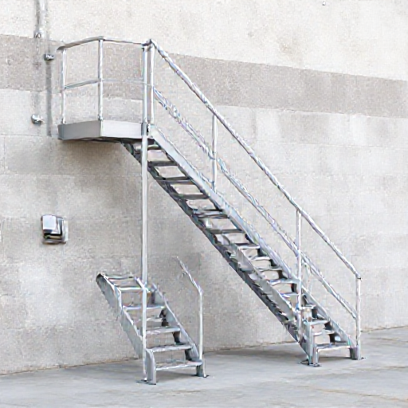

# P-2026-0024 Presupuesto Técnico: Fabricación e Instalación de 4 Escaleras Metálicas con Peldaños Tramex

Fecha: 2026-08-11
Origen: presupuestador-app

## Cliente

- Nombre: Acciona Aguas
- Email:
- Telefono:
- Direccion/obra:
- NIF/CIF: A95113361
- Referencia interna:

## Resumen

Presupuesto para la fabricación, tratamiento y montaje de 4 escaleras metálicas iguales para salvar una altura de 1,50 m cada una. Incluye estructura en tubo rectangular 80x40x3, porta-escalones en ángulo L40x4, peldaños de entramado metálico galvanizado sin pintar, barandilla integrada (pasamanos Ø43, montantes en pletina 40x10 y dos horizontales Ø20), acabado imprimado y pintado en blanco para ambiente marino (Menorca).

_Imagen orientativa generada por IA. El diseno final dependera de medidas, materiales, acabados y validacion tecnica._

## Lineas del compuesto

| ID | Capitulo | Concepto | Cantidad | Unidad | Precio unitario | Importe | Confianza |
|---|---|---|---:|---|---:|---:|---|
| L1 | Diseno | Toma de medidas, replanteo técnico y despiece de estructura | 4 | h | 35.00 | 140.00 | alta |
| L2 | Materiales | Tubo rectangular de acero inoxidable 80x40x3 mm para zancas principales | 24 | ml | 18.50 | 444.00 | alta |
| L3 | Materiales | Ángulo de acero L40x4 mm para porta-escalones | 14 | ml | 3.80 | 53.20 | alta |
| L4 | Materiales | Peldaños de entramado metálico (Tramex) galvanizado en caliente | 32 | ud | 70.00 | 2240.00 | alta |
| L5 | Materiales | Perfiles metálicos para barandilla integrada | 1 | lote | 430.00 | 430.00 | media |
| L6 | Materiales | Tornillería Inox A4, anclajes químicos y elementos de aislamiento galvánico | 1 | lote | 160.00 | 160.00 | alta |
| L7 | Fabricacion | Mano de obra de taller de herrería y soldadura TIG/MIG | 38 | h | 30.00 | 1140.00 | alta |
| L8 | Tratamiento | Tratamiento de pintura C4/C5 para ambiente marino (Estructura y Barandilla) | 4 | ud | 110.00 | 440.00 | alta |
| L9 | Transporte | Transporte local de material y estructura terminada a obra en Menorca | 1 | lote | 120.00 | 120.00 | alta |
| L10 | Montaje | Mano de obra de montaje en obra, aplomado y anclaje | 16 | h | 30.00 | 480.00 | alta |

**Total estimado:** 5647.20 EUR + IVA

## Supuestos

- Se presupuestan 4 unidades de escalera iguales para salvar un desnivel de 1,50 m cada una (8 peldaños por escalera, 16.6 cm de contrahuella aprox.).
- Los peldaños son de entramado metálico (Tramex) galvanizado en caliente y se instalan sin pintar sobre la estructura metálica.
- El acabado pintado en blanco de la estructura incluye imprimación especial de alta adherencia y poliuretano C4/C5 apto para ambiente marino de Menorca.
- El montaje se realiza en un único desembarco y con accesos despejados para la cuadrilla de instalación.

## Riesgos

- Riesgo de desprendimiento de pintura sobre acero inoxidable si no se aplica una imprimación de grabado químico / epoxi adecuada.
- Riesgo de corrosión galvánica en los puntos de contacto entre el acero galvanizado de los peldaños y la estructura de acero inoxidable si no se aislan convenientemente.
- Desviaciones en las cotas de nivel del terreno en la base de las 4 escaleras que requieran suplementos de fijación in situ.

## Preguntas pendientes

- ¿La estructura de tubo 80x40x3 se requiere en calidad inoxidable AISI 316 o AISI 304 teniendo en cuenta la exposición en Menorca y que irá pintada en blanco?
- ¿Cuál es el ancho libre útil deseado para los peldaños de entramado metálico (ej. 800 mm, 900 mm o 1000 mm)?
- ¿Los desembarcos superior e inferior disponen de forjado/muro de hormigón adecuado para recibir la fijación mediante taco químico?

## Sugerencias generadas

- **Aislamiento de par galvánico en peldaños galvanizados sobre inox:** Interponer arandelas y casquillos de EPDM/poliamida en los tornillos de fijación del entramado galvanizado sobre los ángulos de la estructura de acero inoxidable pintada para prevenir par galvánico.
- **Revision manual de linea:** El modo local ha aplicado la instruccion sobre los campos numericos de la linea.
