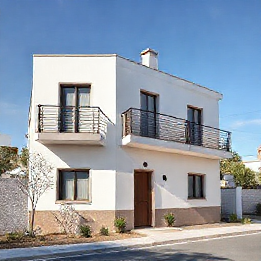

# P-2026-0027 Presupuesto Técnico: Fabricación e Instalación de Barandilla Metálica (20 ml) - Ciutadella de Menorca

Fecha: 2026-08-17
Origen: presupuestador-app

## Cliente

- Nombre: Acciona Aguas
- Email:
- Telefono:
- Direccion/obra:
- NIF/CIF: A95113361
- Referencia interna: Barandilla Pozos exteriores con acceso de escaleras.

## Resumen

Presupuesto para la fabricación e instalación de 20 metros lineales de barandilla recta dividida en 4 tramos con anclaje lateral y acabado pintado para exterior en Ciutadella de Menorca.

_Imagen orientativa generada por IA. El diseno final dependera de medidas, materiales, acabados y validacion tecnica._

## Lineas del compuesto

| ID | Capitulo | Concepto | Cantidad | Unidad | Precio unitario | Importe | Confianza |
|---|---|---|---:|---|---:|---:|---|
| L1 | Diseno | Toma de medidas, replanteo técnico y planos de taller | 12 | h | 35.00 | 420.00 | alta |
| L2 | Materiales | Perfilería y tubos de acero inoxidable AISI 304 | 20 | ml | 85.00 | 1700.00 | media |
| L3 | Materiales | Placas de anclaje lateral y anclajes químicos inoxidable A4 | 1 | lote | 280.00 | 280.00 | alta |
| L4 | Fabricacion | Mano de obra de taller (Corte, ensamblado y soldadura laser) | 32 | h | 40.00 | 1280.00 | alta |
| L5 | Tratamiento | Imprimación promotora de adherencia y sistema de pintura exterior C4 | 20 | ml | 35.00 | 700.00 | media |
| L6 | Transporte | Transporte de material a obra en Ciutadella de Menorca | 1 | lote | 120.00 | 120.00 | alta |
| L7 | Montaje | Mano de obra de instalación en obra y remates | 16 | h | 35.00 | 560.00 | alta |

**Total estimado:** 5060.00 EUR + IVA

## Supuestos

- Ubicación de la obra en Ciutadella de Menorca con acceso habilitado para camión de transporte.
- El paramento base para el anclaje lateral tiene capacidad estructural suficiente para soportar la sobrecarga de 1.6 kN/m según el CTE.
- Se presupuesta el sistema con pintura promotora de adherencia especial sobre acero inoxidable.
- La toma de medidas incluye desplazamiento a Ciutadella y elaboración completa de planimetría/despiece de taller (12 h).

## Riesgos

- Uso de AISI 304 en exterior en ambiente salino de Menorca: alto riesgo de contaminación/pitting por cloruros marinos, produciendo manchas de óxido prematuras.
- Riesgo de descascarillado de pintura sobre acero inoxidable si no se realiza un granallado o lijado químico especializado previo a la imprimación.

## Preguntas pendientes

- ¿Dada la ubicación en exterior en Ciutadella (Menorca), se acepta cambiar la especificación a Acero Inoxidable AISI 316 en lugar de AISI 304 para prevenir picaduras por brisa salina?
- ¿Sobre qué tipo de paramento (hormigón armado, obra de fábrica, canto de forjado) se realizará el anclaje lateral?

## Sugerencias generadas

- **Sustitución de AISI 304 por AISI 316 (A4) o acero galvanizado + lacado:** En Menorca (ambiente marino C4/C5), se aconseja utilizar AISI 316 si la barandilla es de inoxidable vista, o acero al carbono galvanizado en caliente si se va a pintar, garantizando mayor adherencia y durabilidad anticorrosiva.
- **Criterio de horas técnicas para toma de medidas y planimetría en Ciutadella:** Para trabajos que requieran desplazamiento a Ciutadella y levantamiento completo de planimetría/despiece técnico de barandillas, considerar un mínimo de 12 horas técnicas.
