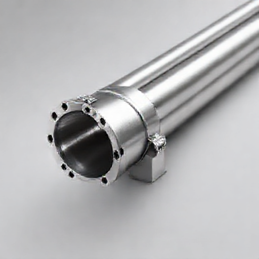

# P-2026-0028 Presupuesto Técnico-Comercial: Fabricación e Instalación de Barandilla Metálica de Acero Inoxidable (20 ml) en Ciutadella de Menorca

Fecha: 2026-08-17
Origen: presupuestador-app

## Cliente

- Nombre: Acciona Aguas
- Email:
- Telefono:
- Direccion/obra:
- NIF/CIF: A95113361
- Referencia interna: Barandilla Pozos exteriores con acceso de escaleras.

## Resumen

Presupuesto para la fabricación e instalación de 20 metros lineales de barandilla metálica dividida en 4 tramos rectos, con anclaje lateral, fabricada en acero inoxidable AISI 304 pintado con acabado C4/C5 para ambiente marino. Incluye toma de medidas, taller, transporte a Ciutadella e instalación en obra.

_Imagen orientativa generada por IA. El diseno final dependera de medidas, materiales, acabados y validacion tecnica._

## Lineas del compuesto

| ID | Capitulo | Concepto | Cantidad | Unidad | Precio unitario | Importe | Confianza |
|---|---|---|---:|---|---:|---:|---|
| L1 | Diseno | Toma de medidas, replanteo técnico y planimetría de taller | 12 | h | 35.00 | 420.00 | alta |
| L2 | Materiales | Perfilería y tubo en acero inoxidable AISI 304 | 20 | ml | 95.00 | 1900.00 | media |
| L3 | Materiales | Kit de anclaje lateral, tacos químicos y tornillería A4 | 1 | lote | 320.00 | 320.00 | alta |
| L4 | Fabricacion | Mano de obra de taller: corte, soldadura TIG y esmerilado | 45 | h | 30.00 | 1350.00 | alta |
| L5 | Tratamiento | Sistema de pintado C4/C5: Imprimación epoxi + esmalte poliuretano | 20 | ml | 40.00 | 800.00 | alta |
| L6 | Transporte | Transporte de barandillas a obra en Ciutadella de Menorca | 1 | lote | 210.00 | 210.00 | alta |
| L7 | Montaje | Montaje en obra, nivelación y anclaje lateral | 28 | h | 30.00 | 840.00 | alta |
| L8 | Margen | Margen industrial y gestión de proyecto | 1 | lote | 1060.00 | 1060.00 | alta |

**Total estimado:** 6900.00 EUR + IVA

## Supuestos

- Se asume que la estructura base o canto de losa sobre la que se realizará el anclaje lateral posee capacidad portante suficiente.
- No se requiere andamiaje ni plataformas elevadoras complejas debido a la accesibilidad media del sitio.
- El acabado es de un color RAL estándar en pintura de poliuretano exterior.

## Riesgos

- Uso de AISI 304 en exterior marino en Menorca: rasguños o desconchones accidentales en la pintura podrían generar picaduras de corrosión aceleradas debido al ambiente salino.
- Afectación o variaciones en la distancia entre anclajes si el canto de la losa presenta irregularidades o falta de plomo.

## Preguntas pendientes

- ¿Se desea contemplar la opción de fabricar en acero inoxidable AISI 316 en lugar de 304, considerando la exposición ambiental exterior en Ciutadella de Menorca para prevenir corrosión por picadura bajo la pintura?
- ¿Cuál es el diseño exacto del relleno de los tramos (barrotes verticales, varillas horizontales o cables de acero)?
- ¿El soporte o canto de losa para el anclaje lateral está en hormigón/obra firme y completamente libre de fisuras?

## Sugerencias generadas

- **Recomendar AISI 316 para exteriores en Menorca:** Según los criterios ambientales de Menorca (C4/C5), el acero inoxidable AISI 304 en exterior costero entraña riesgo de picadura. Se sugiere presupuestar o proponer como opción superior el acero inoxidable AISI 316.
