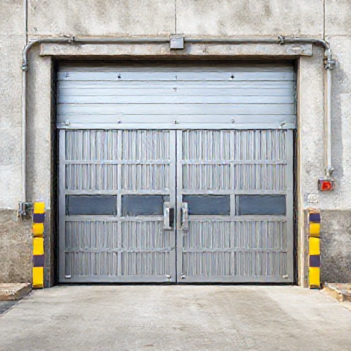

# P-2026-0030 Presupuesto Técnico: Fabricación e Instalación de 4 Puertas Industriales de Acero Inoxidable y PRFV - Ciutadella

Fecha: 2026-08-17
Origen: presupuestador-app

## Cliente

- Nombre: Acciona Aguas
- Email:
- Telefono:
- Direccion/obra: Ciutadella
- NIF/CIF: A95113361
- Referencia interna: 4 Puertas de PRFV y estructura de acero inox

## Resumen

Presupuesto para la fabricación e instalación en Ciutadella de 4 puertas industriales abatibles manuales de 3,45 x 2,96 m (2 unidades con puerta peatonal integrada y 2 unidades sin peatonal). Estructura construida en acero inoxidable AISI 316 con tratamiento de pintura epoxi/poliuretano apto para ambiente marino C4/C5 de Menorca. Revestimiento por ambos lados mediante placas de fibra de vidrio (PRFV) pegadas y remachadas. Incluye herrajes de inox, transporte y montaje en obra con camión grúa. Margen industrial e imprevistos distribuidos proporcionalmente en las partidas de obra.

_Imagen orientativa generada por IA. El diseno final dependera de medidas, materiales, acabados y validacion tecnica._

## Lineas del compuesto

| ID | Capitulo | Concepto | Cantidad | Unidad | Precio unitario | Importe | Confianza |
|---|---|---|---:|---|---:|---:|---|
| L1 | Diseno | Toma de medidas, ingeniería técnica y planos de taller | 12 | h | 38.52 | 462.24 | alta |
| L2 | Materiales | Perfilería y tubos estructurales en Acero Inoxidable AISI 316 | 580 | kg | 9.35 | 5423.00 | media |
| L3 | Materiales | Placas de poliéster reinforced con fibra de vidrio (PRFV) | 81.7 | m2 | 159.35 | 13018.90 | alta |
| L4 | Materiales | Herrajes industriales, bisagras pesadas y cerraduras en inox | 1 | lote | 831.23 | 831.23 | media |
| L5 | Materiales | Adhesivo estructural, remaches AISI 316 y consumibles TIG | 1 | lote | 476.44 | 476.44 | media |
| L6 | Fabricacion | Mano de obra de taller y ensamblaje multimaterial | 84 | h | 37.25 | 3129.00 | alta |
| L7 | Tratamiento | Sistema de pintura anticorrosivo C4/C5 sobre inox | 1 | lote | 1165.75 | 1165.75 | media |
| L8 | Transporte | Transporte de elementos de gran formato a Ciutadella | 1 | lote | 263.56 | 263.56 | alta |
| L9 | Montaje | Mano de obra de instalación y aplomado en obra | 24 | h | 37.25 | 894.00 | alta |
| L10 | Montaje | Servicio de camión grúa de pluma para maniobras de elevación | 1 | lote | 474.88 | 474.88 | alta |
| L11 | Riesgo | Reserva de imprevistos dimensionales e interfaces en obra | 0 | lote | 0.00 | 0.00 | alta |

**Total estimado:** 26139.00 EUR + IVA

## Supuestos

- Se presupuesta acero inoxidable calidad AISI 316 (A4) por defecto al tratarse de una instalación en exterior en Menorca (criterio C4/C5).
- El revestimiento de PRFV se aplica por ambas caras de cada hoja (cara exterior e interior), duplicando la superficie total a 81,70 m².
- La preparación previa del hueco de obra, solera nivelada y líneas de acometida/fijación en Ciutadella corren a cargo de la propiedad.
- El acabado de las placas de PRFV se considera plano/liso comercial según lo indicado por el cliente.
- El permiso de ocupación de vía pública para el camión grúa en Ciutadella (si se requiere) no está incluido en este importe.

## Riesgos

- Diferencia de coeficientes de dilatación térmica entre el acero inoxidable y las placas de PRFV en exposición solar directa continua.
- Posible necesidad de andamiaje auxiliar o corte de calle si el acceso del camión grúa en Ciutadella presenta restricciones de espacio.
- Comprobación del plomo de los pilares existentes en obra; un desplome significativo requerirá calzos inoxidables adicionales.

## Preguntas pendientes

- ¿Confirmar el código de color RAL específico para la pintura de poliuretano sobre la estructura de inoxidable?
- ¿La estructura de soporte existente en obra (pilares/dintel en Ciutadella) es de hormigón/acero y está lista para recibir los anclajes químicos?
- ¿Las 2 puertas peatonales requieren algún sentido de apertura (interior/exterior o izquierda/derecha) o barra antipánico especial?

## Sugerencias generadas

- **Distribución de imprevistos y reserva de riesgos en partidas de obra:** Memorizar la eliminación de la partida explícita de riesgo/imprevistos y su prorrateo en los precios unitarios del presupuesto a petición del usuario.
