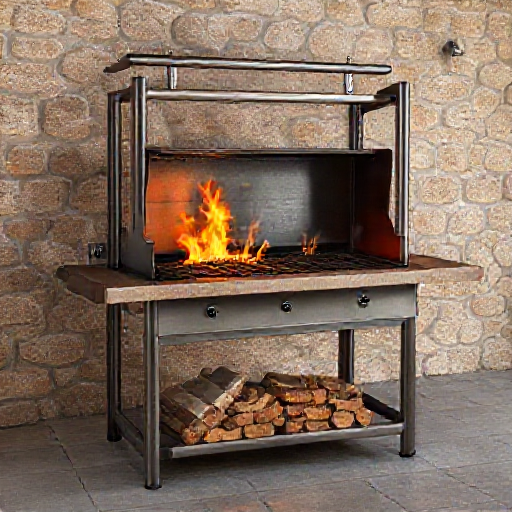

# P-2026-0033 Presupuesto Técnico: Fabricación de Asador de Chapa y Tubo con Tapa (1.2 x 1.0 x 0.6 m)

Fecha: 2026-08-18
Origen: presupuestador-app

## Cliente

- Nombre: Jorge
- Email:
- Telefono:
- Direccion/obra:
- NIF/CIF:
- Referencia interna:

## Resumen

Fabricación a medida de asador/barbacoa metálica en acero al carbono con estructura en tubo 30x30x3 mm y cuba/tapa en chapa de 2 mm. Dimensiones 1200x600x1000 mm. Incluye tapa abatible con bisagras y topes, según referencia visual. Excluye parrilla y quemador lateral por indicación expresa del cliente.

_Imagen orientativa generada por IA. El diseno final dependera de medidas, materiales, acabados y validacion tecnica._

## Lineas del compuesto

| ID | Capitulo | Concepto | Cantidad | Unidad | Precio unitario | Importe | Confianza |
|---|---|---|---:|---|---:|---:|---|
| L1 | Diseno | Diseño técnico y despiece de carpintería metálica | 2 | h | 35.00 | 70.00 | alta |
| L2 | Materiales | Tubo estructural de acero 30x30x3 mm | 18 | ml | 5.80 | 104.40 | alta |
| L3 | Materiales | Chapa de acero al carbono de 2 mm de espesor | 38 | kg | 2.40 | 91.20 | alta |
| L4 | Materiales | Herrajes, ruedas y consumibles de montaje | 1 | lote | 65.00 | 65.00 | media |
| L5 | Fabricacion | Mano de obra de taller: corte, plegado, soldadura y repasado | 10 | h | 35.00 | 350.00 | alta |
| L6 | Tratamiento | Pintura anticalórica especial para exterior en Menorca | 1 | lote | 95.00 | 95.00 | alta |
| L7 | Transporte | Transporte y entrega local en Menorca | 1 | lote | 50.00 | 50.00 | alta |

**Total estimado:** 825.60 EUR + IVA

## Supuestos

- Ubicación por defecto en Menorca.
- No se incluye parrilla ni quemador lateral/fogonero, de acuerdo con la instrucción explícita del cliente.
- El asador se entrega completamente pintado en negro anticalórico apto para intemperie.

## Riesgos

- El uso de brasas directas sobre chapa de 2 mm sin ladrillos refractarios puede provocar deformación térmica del fondo con el tiempo.
- En ambiente salino costero de Menorca, el acero al carbono requiere mantenimiento/retoque periódico con pintura anticalórica para prevenir oxidación.

## Preguntas pendientes

- ¿Desea prever soportes interiores o guías para colocar posteriormente una parrilla a distintas alturas?
- ¿Prefiere que la base de la cuba lleve piso de ladrillo refractario para aislar la chapa del fuego directo?
- ¿Requiere ruedas de mayor diámetro/resistencia si el asador va a rodar sobre césped o grava?

## Sugerencias generadas

- **Protección interior con piso refractario:** Añadir piso de ladrillo refractario en la base de la cuba para prolongar la vida útil de la chapa de 2 mm y lograr mejor retención del calor.
- **Fabricación parcial o total en Acero Inoxidable AISI 316:** Para instalaciones cerca del mar en Menorca, la opción en inox 316 evita por completo el deterioro por corrosión salina.
