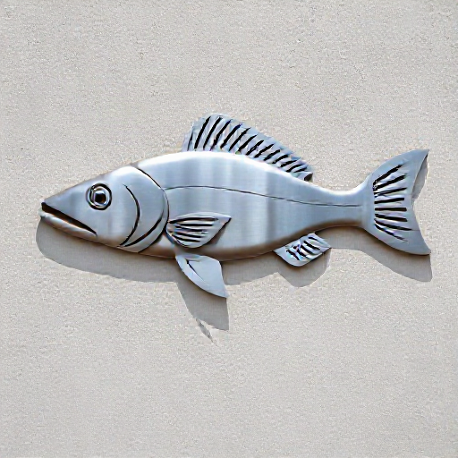

# P-2026-0035 Presupuesto Técnico: Fabricación de Salamandra Menorquina Decorativa en Corte Láser Inox

Fecha: 2026-08-21
Origen: presupuestador-app

## Cliente

- Nombre: David Bell
- Email:
- Telefono:
- Direccion/obra:
- NIF/CIF:
- Referencia interna:

## Resumen

Fabricación a medida de figura decorativa de salamandra menorquina en chapa de acero inoxidable de 2 mm cortada a láser (1300x600 mm aprox.), equipada con 4 soportes traseros soldados de tubo Ø12 mm y varilla roscada M10 para separación y fijación a pared por parte del cliente. Tratamiento con imprimación multiadherente y acabado en esmalte gris apto para ambiente salino de Menorca. Excluido el montaje en obra.

_Imagen orientativa generada por IA. El diseno final dependera de medidas, materiales, acabados y validacion tecnica._

## Lineas del compuesto

| ID | Capitulo | Concepto | Cantidad | Unidad | Precio unitario | Importe | Confianza |
|---|---|---|---:|---|---:|---:|---|
| L1 | Diseno | Oficina técnica y preparación de vector CAD/DXF | 2 | h | 35.00 | 70.00 | alta |
| L2 | Materiales | Chapa de acero inoxidable AISI 316 e=2 mm | 1 | ud | 210.00 | 210.00 | alta |
| L3 | Materiales | Conjunto de fijaciones traseras (Tubo Ø12 + Varilla M10 Inox) | 4 | ud | 12.50 | 50.00 | alta |
| L4 | Fabricacion | Corte láser CNC de alta precisión | 1 | lote | 265.00 | 265.00 | media |
| L5 | Fabricacion | Mano de obra de taller: soldadura TIG, repasado y desbarbado | 3.5 | h | 35.00 | 122.50 | alta |
| L6 | Tratamiento | Tratamiento anticorrosivo y lacado exterior Gris | 1 | lote | 180.00 | 180.00 | alta |
| L7 | Transporte | Embalaje de protección y transporte local en Menorca | 1 | lote | 60.00 | 60.00 | alta |
| L8 | Margen | Margen industrial y gestión de proyecto | 1 | lote | 92.50 | 92.50 | alta |

**Total estimado:** 1050.00 EUR + IVA

## Supuestos

- Se presupone el uso de acero inoxidable AISI 316 por defecto debido al ambiente salino de Menorca.
- El montaje e instalación sobre pared corre a cargo del cliente tal como se ha solicitado.
- No se incluye tacos químicos ni taco sintético de anclaje final a la pared, únicamente los pernos de fijación integrados en la pieza.

## Riesgos

- Daños en el recubrimiento de pintura durante la manipulación y fijación de los tacos por parte del cliente si se golpea la pieza.
- Deformación por calor del corte láser en zonas delgadas si el despiece no mantiene separaciones mínimas en las extremidades.

## Preguntas pendientes

- ¿Tiene preferencia por algún tono de gris específico (ej. RAL 7016 Gris Antracita, RAL 7035 Gris Claro, o acabado metalizado)?
- ¿La instalación se realizará sobre pared de mampostería/marés, hormigón o placa de yeso/madera para confirmar el tipo de taco químico o mecánico que debe aportar el cliente?

## Sugerencias generadas

- **Memorizar tarifa de corte láser decorativo de inox:** Consolidar en las skills de herrería la referencia de corte láser para siluetas orgánicas en chapa de inox de 2 mm con separadores traseros.
